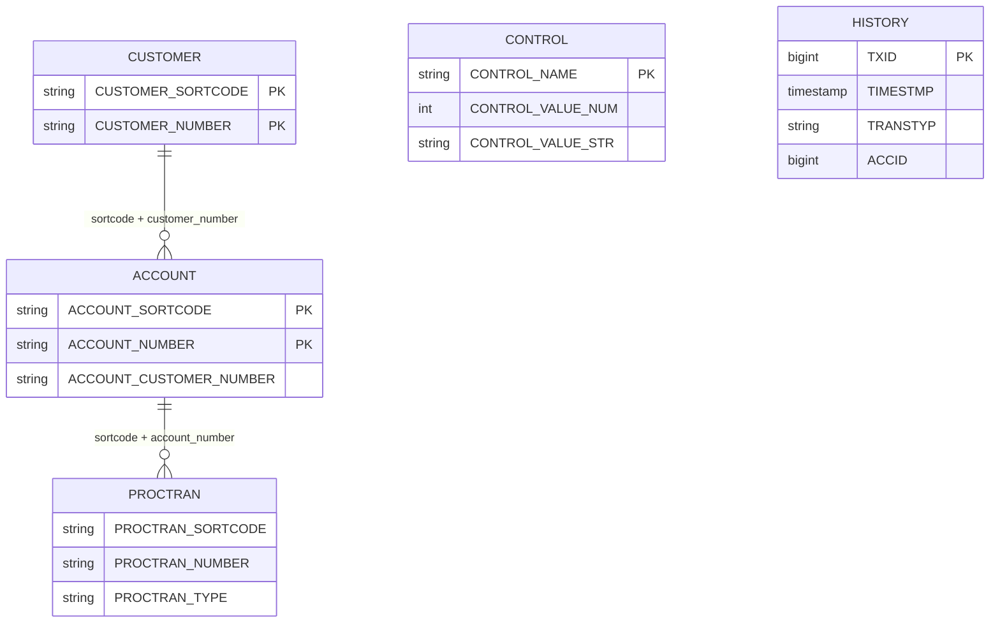

# Data Model

> Current rediscovery pass based on trusted sources in this order: DDL/JCL schema, copybooks, then defensive checks in code.

## Entities

### BANKZ.CUSTOMER

DDL source: `.setup/jcl/cics/Db2-create.jcl:85`.
COBOL record source: `src/base/cics/copy/CUSTOMER.cpy:7`.

| Field | SQL type | COBOL PIC / layout | Evidence |
|---|---|---|---|
| CUSTOMER_EYECATCHER | CHAR(4) | PIC X(4), 88 value `CUST` | `.setup/jcl/cics/Db2-create.jcl:86`; `src/base/cics/copy/CUSTOMER.cpy:8`; `src/base/cics/copy/CUSTOMER.cpy:9` |
| CUSTOMER_SORTCODE | CHAR(6) NOT NULL | PIC 9(6) DISPLAY | `.setup/jcl/cics/Db2-create.jcl:87`; `src/base/cics/copy/CUSTOMER.cpy:11` |
| CUSTOMER_NUMBER | CHAR(10) NOT NULL | PIC 9(10) DISPLAY | `.setup/jcl/cics/Db2-create.jcl:88`; `src/base/cics/copy/CUSTOMER.cpy:12` |
| CUSTOMER_TITLE | CHAR(10) | PIC X(10) | `.setup/jcl/cics/Db2-create.jcl:89`; `src/base/cics/copy/CUSTOMER.cpy:14` |
| CUSTOMER_FIRST_NAME | CHAR(50) | PIC X(50) | `.setup/jcl/cics/Db2-create.jcl:90`; `src/base/cics/copy/CUSTOMER.cpy:15` |
| CUSTOMER_LAST_NAME | CHAR(50) | PIC X(50) | `.setup/jcl/cics/Db2-create.jcl:91`; `src/base/cics/copy/CUSTOMER.cpy:16` |
| CUSTOMER_DATE_OF_BIRTH | INTEGER | Day/Month/Year split PIC 99/99/9999 | `.setup/jcl/cics/Db2-create.jcl:92`; `src/base/cics/copy/CUSTOMER.cpy:18`; `src/base/cics/copy/CUSTOMER.cpy:19`; `src/base/cics/copy/CUSTOMER.cpy:20` |
| CUSTOMER_PHONE | CHAR(20) | PIC X(20) | `.setup/jcl/cics/Db2-create.jcl:93`; `src/base/cics/copy/CUSTOMER.cpy:21` |
| CUSTOMER_ADDR_LINE1 | CHAR(50) | PIC X(50) | `.setup/jcl/cics/Db2-create.jcl:94`; `src/base/cics/copy/CUSTOMER.cpy:23` |
| CUSTOMER_ADDR_LINE2 | CHAR(50) | PIC X(50) | `.setup/jcl/cics/Db2-create.jcl:95`; `src/base/cics/copy/CUSTOMER.cpy:24` |
| CUSTOMER_CITY | CHAR(50) | PIC X(50) | `.setup/jcl/cics/Db2-create.jcl:96`; `src/base/cics/copy/CUSTOMER.cpy:25` |
| CUSTOMER_POSTCODE | CHAR(10) | PIC X(10) | `.setup/jcl/cics/Db2-create.jcl:97`; `src/base/cics/copy/CUSTOMER.cpy:26` |
| CUSTOMER_COUNTRY | CHAR(50) | PIC X(50) | `.setup/jcl/cics/Db2-create.jcl:98`; `src/base/cics/copy/CUSTOMER.cpy:27` |
| CUSTOMER_STATUS | CHAR(10) | PIC X(10), 88-level encoded values | `.setup/jcl/cics/Db2-create.jcl:99`; `src/base/cics/copy/CUSTOMER.cpy:28` |
| CUSTOMER_CREATED_DATE | INTEGER | Day/Month/Year split PIC 99/99/9999 | `.setup/jcl/cics/Db2-create.jcl:100`; `src/base/cics/copy/CUSTOMER.cpy:33`; `src/base/cics/copy/CUSTOMER.cpy:34`; `src/base/cics/copy/CUSTOMER.cpy:35` |
| CUSTOMER_CREDIT_SCORE | SMALLINT | PIC 999 | `.setup/jcl/cics/Db2-create.jcl:101`; `src/base/cics/copy/CUSTOMER.cpy:36` |
| CUSTOMER_CS_REVIEW_DATE | INTEGER | Day/Month/Year split PIC 99/99/9999 | `.setup/jcl/cics/Db2-create.jcl:102`; `src/base/cics/copy/CUSTOMER.cpy:38`; `src/base/cics/copy/CUSTOMER.cpy:39`; `src/base/cics/copy/CUSTOMER.cpy:40` |

Key/index evidence: unique index on `(CUSTOMER_SORTCODE, CUSTOMER_NUMBER)` and secondary name index `(CUSTOMER_LAST_NAME, CUSTOMER_FIRST_NAME)` in `.setup/jcl/cics/Db2-create.jcl:107` and `.setup/jcl/cics/Db2-create.jcl:111`.

### BANKZ.ACCOUNT

DDL source: `.setup/jcl/cics/Db2-create.jcl:25`.
COBOL record source: `src/base/cics/copy/ACCOUNT.cpy:7`.

| Field | SQL type | COBOL PIC / layout | Evidence |
|---|---|---|---|
| ACCOUNT_EYECATCHER | CHAR(4) | PIC X(4), 88 value `ACCT` | `.setup/jcl/cics/Db2-create.jcl:26`; `src/base/cics/copy/ACCOUNT.cpy:8`; `src/base/cics/copy/ACCOUNT.cpy:9` |
| ACCOUNT_CUSTOMER_NUMBER | CHAR(10) | PIC 9(10) | `.setup/jcl/cics/Db2-create.jcl:27`; `src/base/cics/copy/ACCOUNT.cpy:10` |
| ACCOUNT_SORTCODE | CHAR(6) NOT NULL | PIC 9(6) | `.setup/jcl/cics/Db2-create.jcl:28`; `src/base/cics/copy/ACCOUNT.cpy:12` |
| ACCOUNT_NUMBER | CHAR(8) NOT NULL | PIC 9(8) | `.setup/jcl/cics/Db2-create.jcl:29`; `src/base/cics/copy/ACCOUNT.cpy:13` |
| ACCOUNT_TYPE | CHAR(8) | PIC X(8) | `.setup/jcl/cics/Db2-create.jcl:30`; `src/base/cics/copy/ACCOUNT.cpy:14` |
| ACCOUNT_INTEREST_RATE | DECIMAL(6,2) | PIC 9(4)V99 | `.setup/jcl/cics/Db2-create.jcl:31`; `src/base/cics/copy/ACCOUNT.cpy:15` |
| ACCOUNT_OPENED | DATE | PIC 9(8) + DD/MM/YYYY redefines | `.setup/jcl/cics/Db2-create.jcl:32`; `src/base/cics/copy/ACCOUNT.cpy:16`; `src/base/cics/copy/ACCOUNT.cpy:18`; `src/base/cics/copy/ACCOUNT.cpy:19`; `src/base/cics/copy/ACCOUNT.cpy:20` |
| ACCOUNT_OVERDRAFT_LIMIT | INTEGER | PIC 9(8) | `.setup/jcl/cics/Db2-create.jcl:33`; `src/base/cics/copy/ACCOUNT.cpy:21` |
| ACCOUNT_LAST_STATEMENT | DATE | PIC 9(8) + DD/MM/YYYY redefines | `.setup/jcl/cics/Db2-create.jcl:34`; `src/base/cics/copy/ACCOUNT.cpy:22`; `src/base/cics/copy/ACCOUNT.cpy:25`; `src/base/cics/copy/ACCOUNT.cpy:26`; `src/base/cics/copy/ACCOUNT.cpy:27` |
| ACCOUNT_NEXT_STATEMENT | DATE | PIC 9(8) + DD/MM/YYYY redefines | `.setup/jcl/cics/Db2-create.jcl:35`; `src/base/cics/copy/ACCOUNT.cpy:28`; `src/base/cics/copy/ACCOUNT.cpy:31`; `src/base/cics/copy/ACCOUNT.cpy:32`; `src/base/cics/copy/ACCOUNT.cpy:33` |
| ACCOUNT_AVAILABLE_BALANCE | DECIMAL(12,2) | PIC S9(10)V99 | `.setup/jcl/cics/Db2-create.jcl:36`; `src/base/cics/copy/ACCOUNT.cpy:34` |
| ACCOUNT_ACTUAL_BALANCE | DECIMAL(12,2) | PIC S9(10)V99 | `.setup/jcl/cics/Db2-create.jcl:37`; `src/base/cics/copy/ACCOUNT.cpy:35` |

Key/index evidence: unique index on `(ACCOUNT_SORTCODE, ACCOUNT_NUMBER)` and secondary index on `(ACCOUNT_SORTCODE, ACCOUNT_CUSTOMER_NUMBER)` in `.setup/jcl/cics/Db2-create.jcl:42` and `.setup/jcl/cics/Db2-create.jcl:46`.

### BANKZ.PROCTRAN

DDL source: `.setup/jcl/cics/Db2-create.jcl:53`.
COBOL record source: `src/base/cics/copy/PROCTRAN.cpy:7`.

| Field | SQL type | COBOL PIC / layout | Evidence |
|---|---|---|---|
| PROCTRAN_EYECATCHER | CHAR(4) | PIC X(4), 88 valid value `PRTR` | `.setup/jcl/cics/Db2-create.jcl:54`; `src/base/cics/copy/PROCTRAN.cpy:8`; `src/base/cics/copy/PROCTRAN.cpy:9` |
| PROCTRAN_SORTCODE | CHAR(6) NOT NULL | PIC 9(6) | `.setup/jcl/cics/Db2-create.jcl:55`; `src/base/cics/copy/PROCTRAN.cpy:16` |
| PROCTRAN_NUMBER | CHAR(8) NOT NULL | PIC 9(8) | `.setup/jcl/cics/Db2-create.jcl:56`; `src/base/cics/copy/PROCTRAN.cpy:17` |
| PROCTRAN_DATE | DATE | PIC 9(8), YYYYMMDD redefines | `.setup/jcl/cics/Db2-create.jcl:57`; `src/base/cics/copy/PROCTRAN.cpy:18`; `src/base/cics/copy/PROCTRAN.cpy:20`; `src/base/cics/copy/PROCTRAN.cpy:21`; `src/base/cics/copy/PROCTRAN.cpy:22` |
| PROCTRAN_TIME | CHAR(6) | PIC 9(6), HHMMSS redefines | `.setup/jcl/cics/Db2-create.jcl:58`; `src/base/cics/copy/PROCTRAN.cpy:23`; `src/base/cics/copy/PROCTRAN.cpy:25`; `src/base/cics/copy/PROCTRAN.cpy:26`; `src/base/cics/copy/PROCTRAN.cpy:27` |
| PROCTRAN_REF | CHAR(12) | PIC 9(12) | `.setup/jcl/cics/Db2-create.jcl:59`; `src/base/cics/copy/PROCTRAN.cpy:28` |
| PROCTRAN_TYPE | CHAR(3) | PIC X(3), 88-level code domain | `.setup/jcl/cics/Db2-create.jcl:60`; `src/base/cics/copy/PROCTRAN.cpy:29` |
| PROCTRAN_DESC | CHAR(40) | PIC X(40), redefines for encoded payloads | `.setup/jcl/cics/Db2-create.jcl:61`; `src/base/cics/copy/PROCTRAN.cpy:48`; `src/base/cics/copy/PROCTRAN.cpy:49`; `src/base/cics/copy/PROCTRAN.cpy:57`; `src/base/cics/copy/PROCTRAN.cpy:69`; `src/base/cics/copy/PROCTRAN.cpy:81`; `src/base/cics/copy/PROCTRAN.cpy:92` |
| PROCTRAN_AMOUNT | DECIMAL(12,2) | PIC S9(10)V99 | `.setup/jcl/cics/Db2-create.jcl:62`; `src/base/cics/copy/PROCTRAN.cpy:103` |

### BANKZ.CONTROL

DDL source: `.setup/jcl/cics/Db2-create.jcl:70`.
Operational usage source: `src/base/cics/cobol/CRECUST.cbl:1500`, `src/base/cics/cobol/CREACC.cbl:503`.

| Field | SQL type | COBOL PIC / layout | Evidence |
|---|---|---|---|
| CONTROL_NAME | CHAR(32) | Treated as symbolic key (counter name) | `.setup/jcl/cics/Db2-create.jcl:71`; `.setup/jcl/cics/Db2-create.jcl:78`; `src/base/cics/cobol/CRECUST.cbl:1500`; `src/base/cics/cobol/CREACC.cbl:503` |
| CONTROL_VALUE_NUM | INTEGER | Counter payloads mapped to 9(10)/9(8) packed decimal in control copybook | `.setup/jcl/cics/Db2-create.jcl:72`; `src/base/cics/copy/CONTROLI.cpy:7`; `src/base/cics/copy/CONTROLI.cpy:9` |
| CONTROL_VALUE_STR | CHAR(40) | String payload (optional) | `.setup/jcl/cics/Db2-create.jcl:73` |

### IMSBANK.HISTORY

DDL source: `.setup/jcl/ims/Db2-create.jcl:23`.
IMS message copybooks: `src/base/ims/copy/IBSHIST.cpy:24`, `src/base/ims/copy/IBGHIST.cpy:24`.

| Field | SQL type | COBOL PIC / layout | Evidence |
|---|---|---|---|
| TXID | BIGINT UNIQUE NOT NULL | PIC S9(18) COMP-5 | `.setup/jcl/ims/Db2-create.jcl:25`; `src/base/ims/copy/IBSHIST.cpy:24`; `src/base/ims/copy/IBGHIST.cpy:24` |
| TIMESTMP | TIMESTAMP NOT NULL | PIC X(23) | `.setup/jcl/ims/Db2-create.jcl:26`; `src/base/ims/copy/IBSHIST.cpy:25`; `src/base/ims/copy/IBGHIST.cpy:25` |
| TRANSTYP | CHAR(1) NOT NULL | PIC X(1) | `.setup/jcl/ims/Db2-create.jcl:27`; `src/base/ims/copy/IBSHIST.cpy:26`; `src/base/ims/copy/IBGHIST.cpy:26` |
| AMOUNT | DECIMAL(15,2) NOT NULL | PIC S9(13)V9(2) COMP-3 | `.setup/jcl/ims/Db2-create.jcl:28`; `src/base/ims/copy/IBSHIST.cpy:27`; `src/base/ims/copy/IBGHIST.cpy:27` |
| REFTXID | BIGINT NOT NULL | PIC S9(18) COMP-5 | `.setup/jcl/ims/Db2-create.jcl:29`; `src/base/ims/copy/IBSHIST.cpy:28`; `src/base/ims/copy/IBGHIST.cpy:28` |
| ACCID | BIGINT NOT NULL | PIC S9(18) COMP-5 | `.setup/jcl/ims/Db2-create.jcl:30`; `src/base/ims/copy/IBSHIST.cpy:29`; `src/base/ims/copy/IBGHIST.cpy:29` |
| BALANCE | DECIMAL(15,2) NOT NULL | PIC S9(13)V9(2) COMP-3 in IMS transaction program working storage | `.setup/jcl/ims/Db2-create.jcl:31`; `src/base/ims/cobol/IBTRAN.cbl:95` |

## Relationships

| Relationship | Type | Enforcement | Evidence |
|---|---|---|---|
| CUSTOMER `(CUSTOMER_SORTCODE, CUSTOMER_NUMBER)` -> ACCOUNT `(ACCOUNT_SORTCODE, ACCOUNT_CUSTOMER_NUMBER)` | One-to-many by convention | No DB2 FK; accelerated by ACCOUNT index `(ACCOUNT_SORTCODE, ACCOUNT_CUSTOMER_NUMBER)` | `.setup/jcl/cics/Db2-create.jcl:46`; `src/base/cics/cobol/INQACCCU.cbl:88`; `src/base/cics/cobol/INQACCCU.cbl:90` |
| ACCOUNT `(ACCOUNT_SORTCODE, ACCOUNT_NUMBER)` -> PROCTRAN `(PROCTRAN_SORTCODE, PROCTRAN_NUMBER)` | One-to-many by convention | No DB2 FK; transaction writers copy account keys into PROCTRAN rows | `src/base/cics/cobol/DBCRFUN.cbl:528`; `src/base/cics/cobol/DBCRFUN.cbl:529`; `src/base/cics/cobol/XFRFUN.cbl:1620`; `src/base/cics/cobol/XFRFUN.cbl:1621` |
| CONTROL rows -> generated customer/account numbers | Logical lookup table | Program logic selects by `CONTROL_NAME` and updates values | `src/base/cics/cobol/CRECUST.cbl:1500`; `src/base/cics/cobol/CREACC.cbl:503`; `src/base/cics/copy/CONTROLI.cpy:7`; `src/base/cics/copy/CONTROLI.cpy:9` |
| IMS account ACCID -> IMSBANK.HISTORY.ACCID | One-to-many by convention | Program computes TXID and writes history using same ACCID | `src/base/ims/cobol/IBTRAN.cbl:315`; `src/base/ims/cobol/IBTRAN.cbl:316`; `src/base/ims/cobol/IBTRAN.cbl:317` |

## Invariants (including code-only)

| Invariant | Where enforced | Evidence |
|---|---|---|
| Bank sort code is fixed to `987654` for CICS flows. | Constant copybook and multiple programs overwrite/derive sort-code from it. | `src/base/cics/copy/SORTCODE.cpy:7`; `src/base/cics/cobol/CREACC.cbl:310`; `src/base/cics/cobol/CRECUST.cbl:459`; `src/base/cics/cobol/DBCRFUN.cbl:211`; `src/base/cics/cobol/XFRFUN.cbl:281`; `src/base/cics/cobol/INQCUST.cbl:210` |
| Customer title is whitelist-validated. | `EVALUATE COMM-TITLE` accepts known values; `WHEN OTHER` sets invalid flag/fail code. | `src/base/cics/cobol/CRECUST.cbl:415`; `src/base/cics/cobol/CRECUST.cbl:416`; `src/base/cics/cobol/CRECUST.cbl:419`; `src/base/cics/cobol/CRECUST.cbl:422`; `src/base/cics/cobol/CRECUST.cbl:425`; `src/base/cics/cobol/CRECUST.cbl:428`; `src/base/cics/cobol/CRECUST.cbl:431`; `src/base/cics/cobol/CRECUST.cbl:434`; `src/base/cics/cobol/CRECUST.cbl:437`; `src/base/cics/cobol/CRECUST.cbl:440`; `src/base/cics/cobol/CRECUST.cbl:443`; `src/base/cics/cobol/CRECUST.cbl:449`; `src/base/cics/cobol/CRECUST.cbl:453`; `src/base/cics/cobol/CRECUST.cbl:455` |
| Date-of-birth must pass LE date conversion / validity checks. | DOB is converted with `CEEDAYS`; non-zero feedback marks DOB error and sets fail code. | `src/base/cics/cobol/CRECUST.cbl:1570`; `src/base/cics/cobol/CRECUST.cbl:1575`; `src/base/cics/cobol/CRECUST.cbl:1576`; `src/base/cics/cobol/CRECUST.cbl:1590`; `src/base/cics/cobol/CRECUST.cbl:1591`; `src/base/cics/cobol/CRECUST.cbl:1601`; `src/base/cics/cobol/CRECUST.cbl:1607` |
| Customer delete requires zero linked accounts. | `NUMBER-OF-ACCOUNTS > 0` blocks delete path. | `src/base/cics/cobol/DELCUS.cbl:328` |
| Account inquiry treats `99999999` as special/sentinel input and rejects blank account type payloads. | Defensive checks before returning data. | `src/base/cics/cobol/INQACC.cbl:218`; `src/base/cics/cobol/INQACC.cbl:229` |
| Customer inquiry treats blank sort-code and `0000000000`/`9999999999` customer numbers as special/sentinel values. | Defensive checks/defaulting before lookup. | `src/base/cics/cobol/INQCUST.cbl:209`; `src/base/cics/cobol/INQCUST.cbl:210`; `src/base/cics/cobol/INQCUST.cbl:225`; `src/base/cics/cobol/INQCUST.cbl:239` |
| Transfer requires positive amount and different source/target accounts. | Validation before DB2 update. | `src/base/cics/cobol/XFRFUN.cbl:289`; `src/base/cics/cobol/XFRFUN.cbl:316` |
| Transfer flow does not enforce overdraft limit. | Program comment states no overdraft check. | `src/base/cics/cobol/XFRFUN.cbl:21` |
| IMS transaction type input must be one of `d`,`w`,`D`,`W`. | Guard condition in `IBTRAN`. | `src/base/ims/cobol/IBTRAN.cbl:294`; `src/base/ims/cobol/IBTRAN.cbl:295` |

## Value Domains (encoded fields)

### CUSTOMER_STATUS (CICS)

From 88-level definitions:

| Value | Meaning | Evidence |
|---|---|---|
| ACTIVE | Active customer | `src/base/cics/copy/CUSTOMER.cpy:29` |
| INACTIVE | Inactive customer | `src/base/cics/copy/CUSTOMER.cpy:30` |
| SUSPENDED | Suspended customer | `src/base/cics/copy/CUSTOMER.cpy:31` |

### ACCOUNT_TYPE (CICS)

Accepted in create-account validation and seed data:

| Value | Meaning (in code) | Evidence |
|---|---|---|
| ISA | ISA account type | `src/base/cics/cobol/CREACC.cbl:1310`; `src/base/cics/cobol/BANKDATA.cbl:1363` |
| SAVING | Savings account type token used in code/data seeding | `src/base/cics/cobol/CREACC.cbl:1312`; `src/base/cics/cobol/BANKDATA.cbl:1364` |
| CURRENT | Current account type | `src/base/cics/cobol/CREACC.cbl:1313`; `src/base/cics/cobol/BANKDATA.cbl:1365` |
| LOAN | Loan account type | `src/base/cics/cobol/CREACC.cbl:1314`; `src/base/cics/cobol/BANKDATA.cbl:1366` |
| MORTGAGE | Mortgage account type | `src/base/cics/cobol/CREACC.cbl:1311`; `src/base/cics/cobol/BANKDATA.cbl:1367` |

### PROCTRAN_TYPE (CICS)

From 88-level definitions in `PROCTRAN.cpy`:

| Value | Meaning | Evidence |
|---|---|---|
| CHA | Cheque acknowledged | `src/base/cics/copy/PROCTRAN.cpy:30` |
| CHF | Cheque failure | `src/base/cics/copy/PROCTRAN.cpy:31` |
| CHI | Cheque paid in | `src/base/cics/copy/PROCTRAN.cpy:32` |
| CHO | Cheque paid out | `src/base/cics/copy/PROCTRAN.cpy:33` |
| CRE | Credit | `src/base/cics/copy/PROCTRAN.cpy:34` |
| DEB | Debit | `src/base/cics/copy/PROCTRAN.cpy:35` |
| ICA | Web create account | `src/base/cics/copy/PROCTRAN.cpy:36` |
| ICC | Web create customer | `src/base/cics/copy/PROCTRAN.cpy:37` |
| IDA | Web delete account | `src/base/cics/copy/PROCTRAN.cpy:38` |
| IDC | Web delete customer | `src/base/cics/copy/PROCTRAN.cpy:39` |
| OCA | Branch create account | `src/base/cics/copy/PROCTRAN.cpy:40` |
| OCC | Branch create customer | `src/base/cics/copy/PROCTRAN.cpy:41` |
| ODA | Branch delete account | `src/base/cics/copy/PROCTRAN.cpy:42` |
| ODC | Branch delete customer | `src/base/cics/copy/PROCTRAN.cpy:43` |
| OCS | Create standing order direct debit | `src/base/cics/copy/PROCTRAN.cpy:44` |
| PCR | Payment credit | `src/base/cics/copy/PROCTRAN.cpy:45` |
| PDR | Payment debit | `src/base/cics/copy/PROCTRAN.cpy:46` |
| TFR | Transfer | `src/base/cics/copy/PROCTRAN.cpy:47` |

### TRANSTYP (IMS)

| Value(s) | Meaning | Evidence |
|---|---|---|
| d / D | Deposit path accepted by guard condition | `src/base/ims/cobol/IBTRAN.cbl:294`; `src/base/ims/cobol/IBTRAN.cbl:343` |
| w / W | Withdrawal path accepted by guard condition | `src/base/ims/cobol/IBTRAN.cbl:294`; `src/base/ims/cobol/IBTRAN.cbl:340` |

## Notes On Observed Drift (for reviewer awareness)

- DDL and SQL DECLARE/copybook shapes are not fully identical for some columns (for example `ACCOUNT_INTEREST_RATE` and balance precision in ACCOUNT; `PROCTRAN_DATE` DATE vs `CHAR(8)` in `PROCDB2.cpy`). See `.setup/jcl/cics/Db2-create.jcl:31`, `.setup/jcl/cics/Db2-create.jcl:36`, `.setup/jcl/cics/Db2-create.jcl:37`, `src/base/cics/copy/ACCDB2.cpy:13`, `src/base/cics/copy/ACCDB2.cpy:18`, `src/base/cics/copy/ACCDB2.cpy:19`, `.setup/jcl/cics/Db2-create.jcl:57`, `src/base/cics/copy/PROCDB2.cpy:12`.
- `CONTDB2.cpy` declares `STTESTER.CONTROL` while DDL creates `BANKZ.CONTROL`. See `src/base/cics/copy/CONTDB2.cpy:7` and `.setup/jcl/cics/Db2-create.jcl:70`.